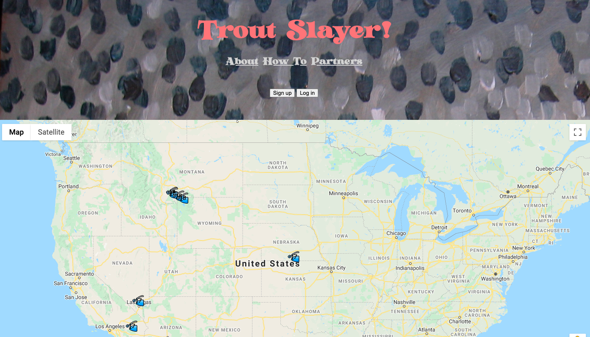

# trout-slayer
A small web app to help track where you've caught some fish.

If you like fishing, this app can help you track where, when, and under what conditions (like weather, gear, lure/bait, etc.) you caught your fish. This data is public to everyone in order to help us all become better fishers!

# Installation for Local Dev
## Rails backend
In order to run this app locally, clone this repository.

Navigate to the `trout-slayer-backend` directory and run:
```
bundle install
```
Then we can initialize the database:
```
rails db:migrate
```
Now we can start the server:
```
rails s
```
This will start a Rails web server at [http://localhost:3000](http://localhost:3000). Keep this running in a terminal window.

## Javascript frontend
First, install [http-server](https://www.npmjs.com/package/http-server) however you see fit, or run it on-demand.

Navigate to the `trout-slayer-frontend` and run the frontend http-server:
```
http-server
```
This will start the frontend web server at [http://localhost:8080](http://localhost:8080). You should be able to see the app now!

## Google Maps API Key
In order to use this locally, you'll need your own Google Maps API Key. Follow the instructions [here](https://developers.google.com/maps/documentation/javascript/get-api-key) to set one up, then replace `YOUR_API_KEY` line in `index.html` with your key:
```
index.html:12:
<script defer src="https://maps.googleapis.com/maps/api/js?key=[YOUR_API_KEY]&callback=createMap"></script>
```
I also recommend restricting the API key to your frontend server URL, which is in the same documentation.

Once that propagates, you should be good to go! Your browser should look something like this:


Sign up and start pinning your catches!

# Security Disclaimer
This app is a timeboxed bootcamp project and is my first usage of vanilla Javascript and the Rails API together. Thus, the way that I'm managing user authentication and authorization in this app is less than ideal and can be easily hacked by anyone using it. 

Ergo, **use at your own risk**. Though you shouldn't have any issues when running the app locally.

Before hosting this publicly, I will be refactoring this app to authenticate users and authorize actions with [JSON Web Tokens (JWT)](https://jwt.io/). If you'd like to help, hit me up!

# Contributing
Pull requests are not only welcome, they're encouraged! For major changes, please open an issue first to discuss what you would like to change.

* * *

# Demo and Blog

Demo: https://www.youtube.com/watch?v=Ylq7dlym4gg

Blog: https://kopsho.cafe/blog/slaying-trout-with-json.html

# License
[MIT](./LICENSE)
